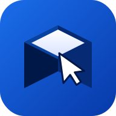
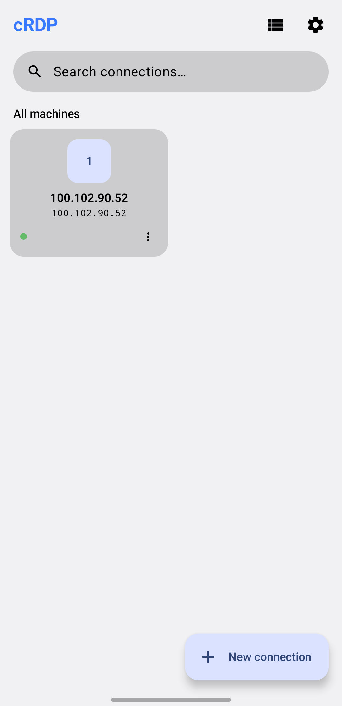
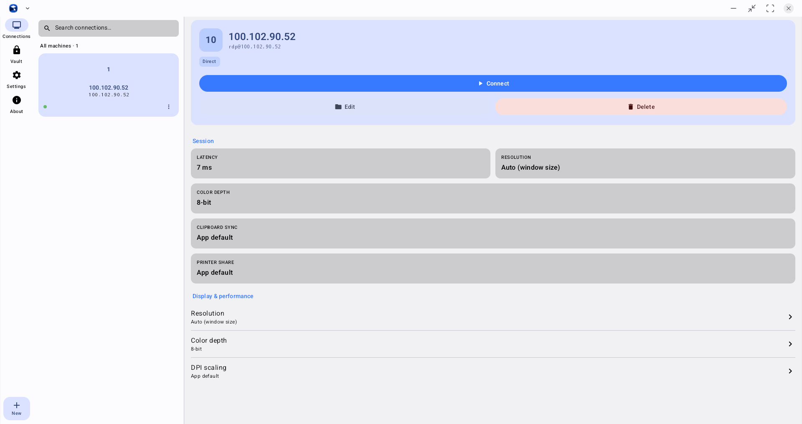

  

# cRDP

A modern Android RDP client for connecting to Windows desktops from your phone,
tablet, or DeX/desktop-mode display.

Built on FreeRDP, designed for touch-first use, and ready for big screens.

> ⚠️ **Work in progress.** cRDP is still work in progress - features may
> change, break, or disappear between builds, and rough edges are expected.
> This project is also **heavily vibe-coded**: a lot of it was written with
> AI assistants (Claude, Cursor) in the loop. Treat it as an enthusiastic
> hobby project, not a polished commercial product.

> Looking for build instructions, module layout, or engine internals?
> See the **[Technical Wiki](docs/TECHNICAL.md)**.

---

## Screenshots

**Phone**

  

**Desktop / Samsung DeX**

  

---

## Features

### Connect your way
- **Direct connections** — straight TCP to any Windows host on your network.
- **Gateway connections** — relay through a WebSocket gateway when you can't
  reach the host directly.
- **Saved profiles** with quick-launch, per-connection settings, and an
  organized connection list.

### Touch-first, but desktop-ready
- **Real multi-touch** via RDPEI — direct touch on the remote desktop, not just
  emulated mouse clicks.
- **Tap-and-half drag**, signed scroll wheel, and gesture-aware input that
  feels right on a phone.
- **DeX / desktop-mode shell** — a proper windowed experience when you dock
  your phone or run on a large screen.

### Looks and feels right
- Material 3 UI with light/dark theming.
- Clean session screen that gets out of the way.
- Connection details and session info when you want them.

### Secure by default
- **Credential vault** with biometric unlock.
- Credentials stay on-device; nothing shipped to the cloud.

### Hardware redirection
- **Webcam redirect** with H.264 — follows phone orientation.
- **Printer redirect** (Android print framework).
- Clipboard sync between phone and remote desktop.

---

## Install

Grab the latest APK from the Releases page, or build from source — see the
[Technical Wiki](docs/TECHNICAL.md#building) for build instructions.

---

## Quick start

1. Open cRDP and tap **+** to add a connection.
2. Enter the host address, username, and (optionally) save credentials to the
   vault.
3. Tap the profile to connect.

That's it. For gateway setups, advanced flags, or troubleshooting, see the
[Technical Wiki](docs/TECHNICAL.md).

---

## License & credits

cRDP is free software released under the
[GNU General Public License v3.0](LICENSE).

It is built on top of [FreeRDP](https://www.freerdp.com/) and a number of
other open-source components — see [THIRD_PARTY.md](THIRD_PARTY.md) for the
full list, and the in-app About screen for per-component license text.
